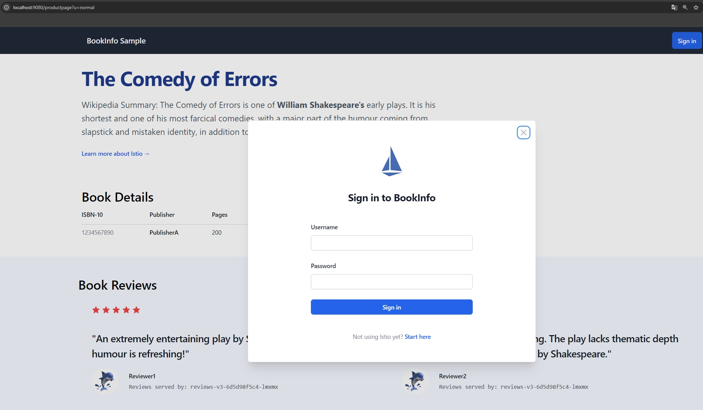

# Exercise 5.2: Getting started with Istio service mesh

## Summary

Istio was installed using the Istio CLI and configured in Ambient mode on a k3d cluster. The sample application was deployed and successfully connected to the ambient service mesh without sidecar proxies.

Network traffic and connectivity were verified according to the tutorial, and all deployed resources were cleaned up afterwards.

Everything was successfully deployed and running as expected.

## Screenshot

