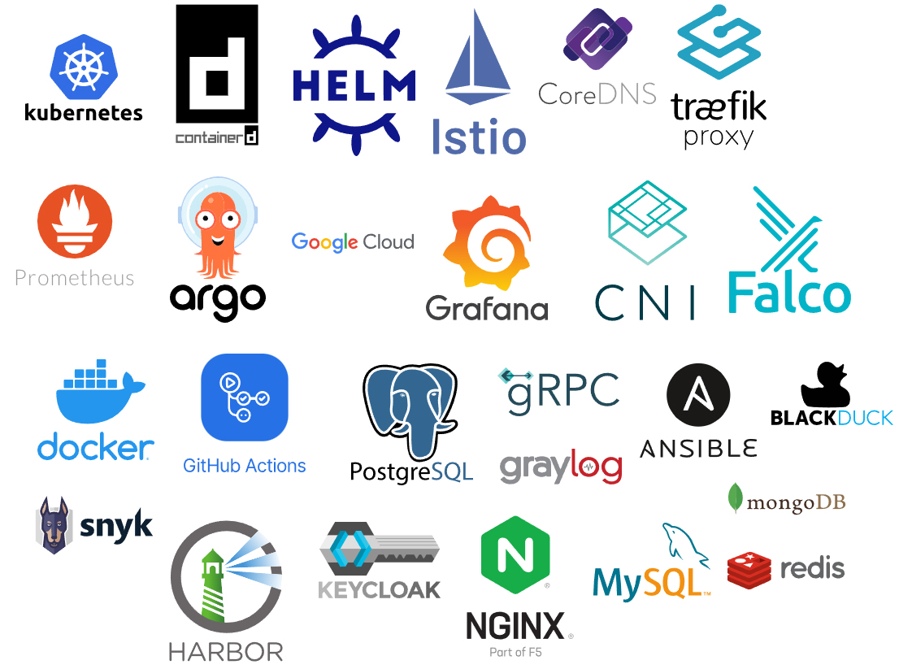

# CNCF Landscape Skillset

This landscape includes the cloud-native and supporting technologies I have used during the course and related projects.

Kubernetes was used as the core orchestration platform, with k3d for running local clusters and containerd as the container runtime.

Docker was used to build and package application images.

Helm was used for installing and managing Kubernetes applications.

Istio was used as a service mesh in Ambient mode for traffic management and service-to-service communication.

Traefik and NGINX were used as ingress controllers and reverse proxies.

CoreDNS was used for internal DNS resolution inside the cluster.

Prometheus and Grafana were used for monitoring, metrics collection, and visualization.

Argo CD was used for GitOps-based continuous deployment.

CNI components were used for container networking, and Falco was used for runtime security monitoring.

Google Cloud and GKE were used as cloud infrastructure outside the local environment.

GitHub Actions was used for CI/CD pipelines.

PostgreSQL, MySQL, MongoDB, and Redis were used as data storage backends.

gRPC was used for service-to-service communication.

Ansible was used for configuration management and automation.

Harbor was used as a container registry.

Security tooling such as Snyk and Black Duck was used for dependency and vulnerability scanning.

